```{python}
#| label: setup
#| include: false
import sys
from pathlib import Path

sys.path.insert(0, str(Path("scripts").resolve()))

import matplotlib.pyplot as plt
import pandas as pd

plt.rcParams.update({
    "figure.dpi": 140,
    "axes.spines.top": False,
    "axes.spines.right": False,
    "font.size": 10,
})
```

## Overview {.regular}

::: {.compact}
1. **Open flight data:** turn surveillance data into cleaned trajectories for climate analysis.
2. **Emissions:** use aircraft performance models to estimate fuel burn and pollutants.
3. **Weather and contrails:** connect trajectories to meteorology and persistent-contrail conditions.
4. **Optimization:** compare fuel-optimal, contrail-aware, and operationally feasible trajectories.
:::

::: {.callout}
Objective: understand how open aviation data, performance models, weather data, and optimization can be combined into a reproducible workflow for reducing aviation climate impact.
:::

## The question that started this work {.regular}

::: {.callout}
Is it possible to use only open data to study aircraft performance, simulate trajectories, infer fuel burn, and estimate emissions?
:::

::: {.compact}
- This was the core research question behind OpenAP.
- The answer became a research stack: OpenSky, pyopensky, OpenAP, FastMeteo, contrail models, and opentop.
- Today’s lecture is about how that stack becomes a climate-impact workflow.
:::

## Why _openness_ matters in climate mitigation {.regular}

::: {.two-col}
:::{.compact}
- Aviation climate studies combine many uncertain assumptions.
- Proprietary data and closed models make those assumptions hard to inspect.
- Open workflows let others rerun, audit, challenge, and extend the result.
- This is especially important when outputs support operational or policy decisions.
:::

::: {.stack-diagram}
::: {.stack-layer}
**Data**
`OpenSky`, ADS-B, Mode S, ADS-C
:::

::: {.stack-layer}
**Models**
`OpenAP`, `FastMeteo`, contrail physics
:::

::: {.stack-layer}
**Optimization**
`opentop`, cost grids, trajectory constraints
:::

::: {.stack-layer}
**Scrutiny**
versioned code, open assumptions, reproducible figures
:::
:::
:::

## What is runnable in this lecture? {.code}

The code slides use cached sample data so the lecture can render without OpenSky credentials or large weather downloads.

```{python}
from pathlib import Path
import sys

sys.path.insert(0, str(Path("scripts").resolve()))

from isa_demo import load_sample_flight

flight = load_sample_flight()
flight[["timestamp", "typecode", "origin", "destination", "latitude", "longitude", "altitude"]].head()
```

# Open Flight Data

## OpenSky is more than state vectors {.regular}

::: {.two-col}
:::{.compact}
- State vectors: positions, velocities, altitude, vertical rate.
- Raw Mode S: aircraft-derived parameters, richer surveillance messages.
- Flight lists: historical flight-level filtering and aggregation.
- Aircraft database: type and registration lookup for model assignment.
- ADS-C: remote and oceanic trajectory/intention information.
:::

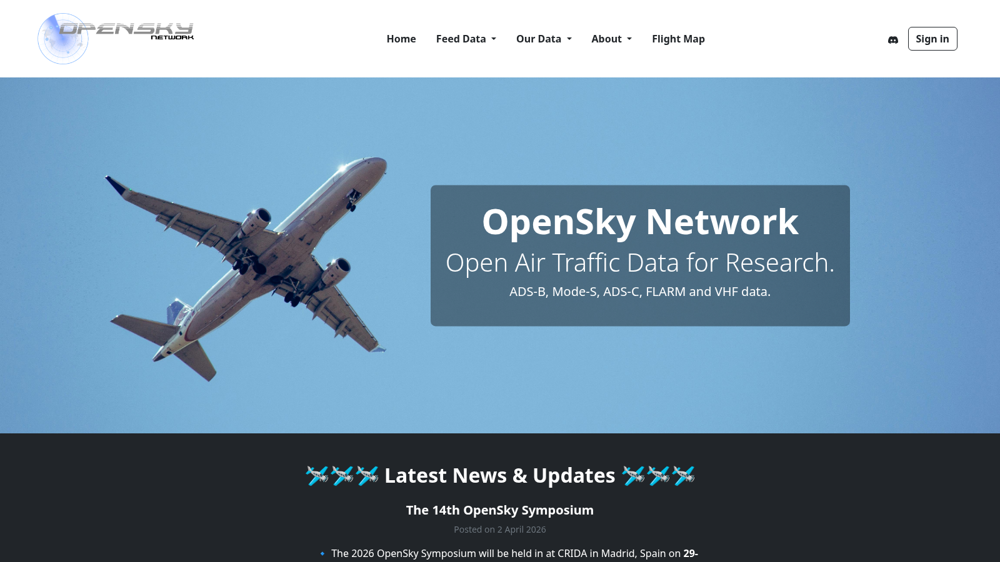{.fit-img}
:::

## Most climate workflows start with this table {.regular}

| Field | Climate-use role | Typical issue |
|---|---|---|
| `time` | weather merge, duration, traffic state | irregular sampling |
| `icao24`, callsign | flight and aircraft identity | callsign ambiguity |
| latitude, longitude | trajectory, sector, route | coverage gaps |
| altitude | phase, contrail level, fuel model | barometric vs geometric altitude |
| velocity, vertical rate | performance state | wind and noise |

## pyopensky access patterns {.code}

This cell is disabled for reliable rendering. It shows the intended live and historical query paths.

::: {.two-col}
::: {}
**Live state vectors: REST**

```{python}
#| eval: false
from pyopensky.rest import REST

rest = REST()
states = rest.states()
track = rest.tracks(icao24="3c6444")
```
:::

::: {}
**Historical state vectors: Trino**

```{python}
#| eval: false
from pyopensky.trino import Trino

trino = Trino()
flights = trino.flightlist(
    start="2024-06-01",
    stop="2024-06-02",
    airport="EHAM",
)

states = trino.history(
    start="2024-06-01 12:00",
    stop="2024-06-01 13:00",
    bounds=(3.0, 7.5, 50.0, 54.0),
)
```
:::
:::

## OSTK: OpenSky Toolkit {.regular}

::: {.ostk-tagline}
OSTK is a desktop toolkit for OpenSky historical-data workflows: <https://github.com/junzis/ostk>
:::

<div class="ostk-showcase">
  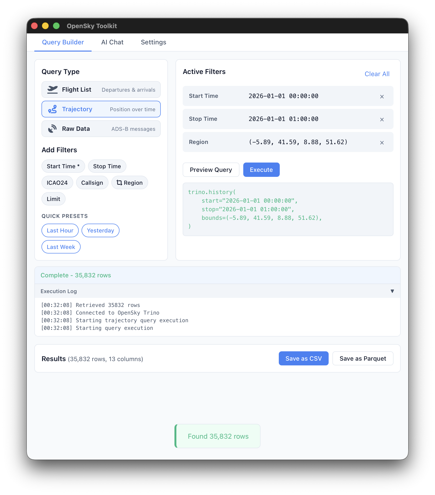
  
</div>

## Load and inspect one trajectory {.code}

Start with one cached OpenSky flight so the rest of the lecture can run without credentials or a live database query.

```{python}
flight = load_sample_flight()
flight.shape, flight.timestamp.min(), flight.timestamp.max()
```

```{python}
flight.phase.value_counts()
```

## Trajectory geometry and vertical behavior {.code}

::: {.two-col}
::: {}

```{python}
#| fig-width: 5.8
#| fig-height: 3.9
#| out-width: 100%
from isa_demo import plot_trajectory

plot_trajectory(flight)
```

:::

::: {}
```{python}
#| fig-width: 5.8
#| fig-height: 3.9
#| out-width: 100%
from isa_demo import plot_vertical_profile

plot_vertical_profile(flight)
```

:::
:::

# From Trajectories to Emissions

## Why OpenAP exists {.regular}

::: {.two-col}
:::{.compact}
- Surveillance tells us what happened.
- Performance models estimate the physical effort required.
- Fuel and emissions need aircraft type, engine, mass, speed, altitude, and atmosphere.
- OpenAP was built to make that bridge open and reproducible.
:::

::: {.img-tight}
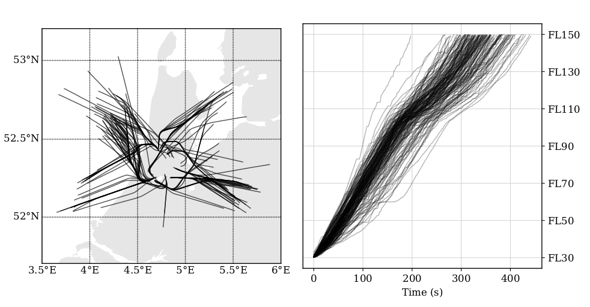
:::
:::

## OpenAP model stack {.regular}

::: {.model-grid}
::: {.metric}
**Kinematic**

Speed, altitude, and vertical-rate envelopes from open trajectories
:::

::: {.metric}
**Dynamic**

Drag polar, thrust, fuel flow, aircraft mass sensitivity
:::

::: {.metric}
**Environment**

OpenAP emission indices; FastMeteo for wind, temperature, and humidity
:::

::: {.metric}
**Optimization**

Trajectory objectives, constraints, and climate-aware routing
:::
:::

## Kinematics: learning flight behavior from data {.regular}

::: {.two-col}
:::{.compact}
- Open trajectories reveal common speed and vertical-rate profiles.
- These models support simulation and trajectory generation.
- They also expose where the observed trajectory is operationally unusual.
:::

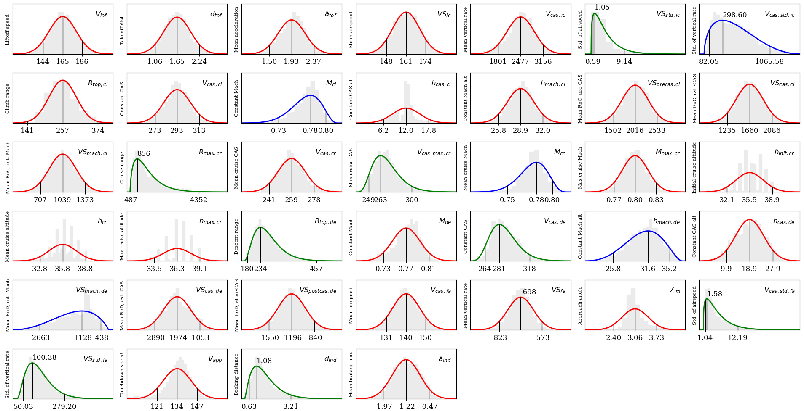{.fit-img}
:::

## Dynamic models: drag, thrust, and mass {.regular}

::: {.two-col}
:::{.compact}
- Dynamic models connect flight state to drag, thrust, fuel flow, and mass.
- Drag-polar coefficients can be estimated from open ADS-B trajectories.
- Mass is the hardest hidden state: it drives climb, fuel burn, and prediction.
- Particle filters combine ADS-B climb-rate evolution with OpenAP dynamics.
- Recent work uses the EUROCONTROL PRC Data Challenge 2024 dataset.

::: {.source}
Paper: <https://doi.org/10.59490/joas.2025.8252>
:::
:::

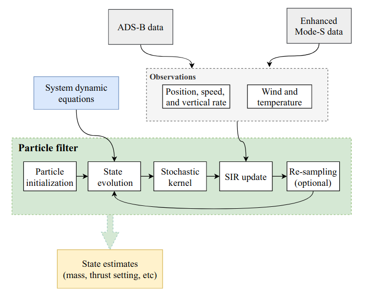{.fit-img}
:::

## Aircraft model inputs for mass and emissions {.code}

OpenAP exposes the aircraft limits and default engine used by the performance model; these values define the mass range behind fuel, emissions, and trajectory predictions.

:::: {.columns}
::: {.column width="48%"}
```{python}
import openap

aircraft = openap.prop.aircraft("A319")
```
:::

::: {.column width="52%"}
::: {.compact}
**A319 model record**

- Aircraft: Airbus A319
- Mass: OEW 40.8 t, MLW 62.5 t, MTOW 75.5 t
- Limits: VMO 350 kt, MMO 0.82, ceiling 12.5 km
- Geometry: wing area 124 m2, span 35.8 m
- Engine: 2 x V2524-A5
- Drag polar: CD0 0.020, k 0.039, e 0.783
- Fuel coefficient: 2.3336
:::
:::
::::

## Fuel and emissions from a trajectory {.code}

```{python}
from isa_demo import compute_openap_emissions

flight_perf = compute_openap_emissions(flight)
flight_perf[["elapsed_min", "altitude", "groundspeed", "fuel_flow_kg_s", "fuel_kg", "co2_kg", "nox_g"]].head()
```

## Emission estimate along the flight {.code}

```{python}
totals = flight_perf[["fuel_kg", "co2_kg", "nox_g"]].sum()
totals.round(1)
```

```{python}
from isa_demo import plot_emission_timeseries

plot_emission_timeseries(flight_perf)
```

## Bottom-up emission estimation {.regular}

::: {.two-col}
:::{.compact}
- Start from individual trajectories, not schedules or great-circle routes.
- Estimate fuel and emissions for every flight segment.
- Aggregate by grid cell, airline, FIR, aircraft type, or flight level.
- More realistic than schedule + great-circle approximations.
- Captures route, altitude, and holding/inefficiency effects.
- **Limitation**: surveillance coverage, mass assumptions, and model accuracy.
:::

::: {.stacked-images}
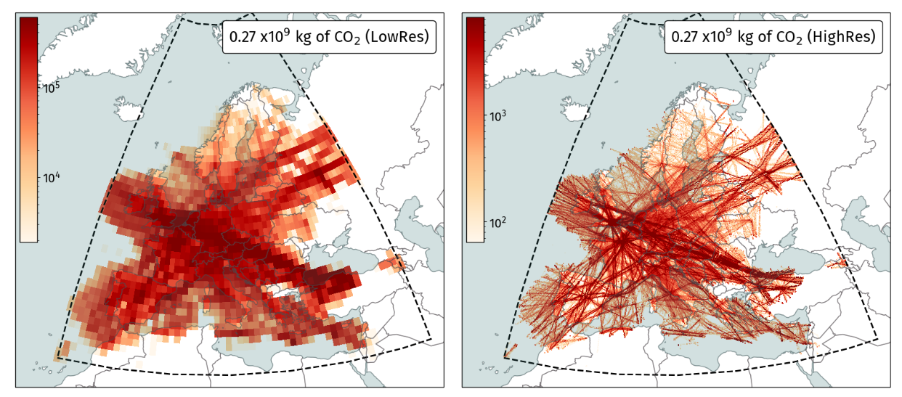

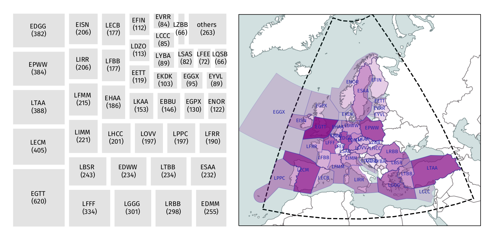
:::
:::

## AeroSCOPE: using open data to tackle emissions coverage gaps {.regular}

::: {.two-col}
:::{.compact}
- AeroSCOPE combines open traffic sources into a global route and emissions database.
- It addresses data gaps with estimation methods where regional datasets are missing.
- Population and econometric proxies can estimate flows in regions with weak surveillance coverage, such as Africa, South America, and parts of Asia.
- Dataset and code: <https://github.com/AeroMAPS/AeroSCOPE_dataset>
:::

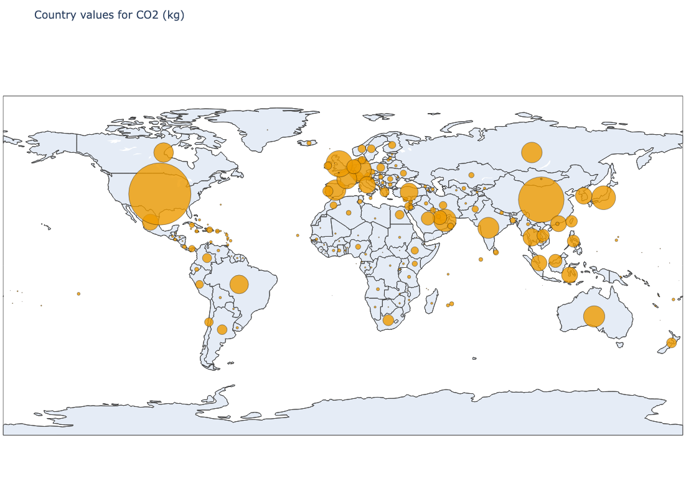{.fit-img}
:::

# Contrails and Weather

## Contrails are where the open-data workflow becomes fragile {.regular}

::: {.two-col}
:::{.compact}
- CO2 is tied directly to fuel burn.
- Contrails depend on atmospheric state, altitude, time, and persistence.
- A small subset of flights can dominate short-term warming.
- Forecast uncertainty can decide whether a rerouting is beneficial or harmful.
:::

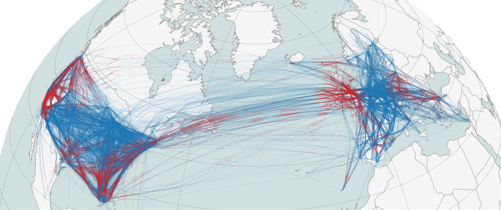{.fit-img}
:::

## Weather data bottlenecks led to FastMeteo {.regular}

::: {.two-col}
:::{.compact}
- Contrail prediction needs weather sampled along each trajectory.
- Traditional workflows move large GRIB/NetCDF files to extract small slices.
- For millions of flights, this becomes the computational bottleneck.
- FastMeteo interpolates ERA5 and forecast fields at trajectory points.
- Useful for wind-aware fuel estimation and contrail screening.
:::

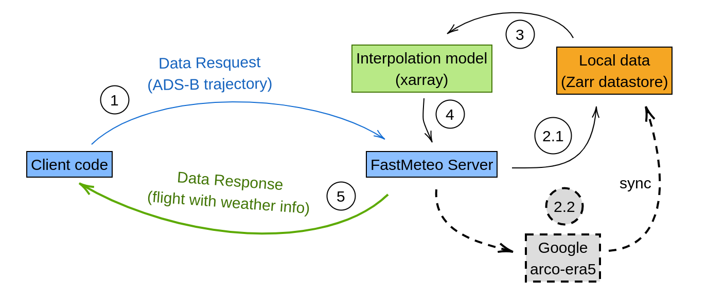{.fit-img}
:::

## What parameters do contrail methods need? {.regular}

::: {.two-col}
:::{.compact}
- Pressure or altitude from the trajectory.
- Temperature from meteorological data.
- Humidity from meteorological data.
- Formation condition: Schmidt-Appleman criterion.
- Persistence condition: ice supersaturation.
:::

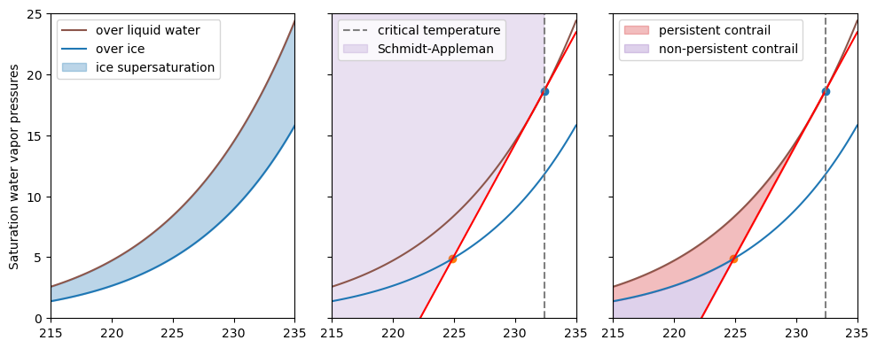{.fit-img}
:::

## Add real weather with FastMeteo {.code}

Use the example flight from the FastMeteo paper workflow. The paper notebook used `Grid`; the current API uses `ArcoEra5`.

```{python}
#| eval: false
import pandas as pd
from fastmeteo.source import ArcoEra5

flight = pd.read_csv(
    "assets/fastmeteo_example_flight.csv",
    parse_dates=["timestamp"],
)

era5 = ArcoEra5(local_store="/tmp/era5-zarr")
flight_weather = era5.interpolate(flight)
```

## Diagnose contrail regions with OpenAP {.code}

::: {.two-col .wide-right}
:::{}

```{python}
#| eval: false
from openap import aero, contrail

flight_contrail = flight_weather.assign(
    rhi=lambda d: contrail.relative_humidity(
        d.specific_humidity,
        aero.pressure(d.altitude * aero.ft),
        d.temperature,
        to="ice",
    ),
    crit_temp=lambda d: contrail.critical_temperature_water(
        aero.pressure(d.altitude * aero.ft)
    ),
    sac=lambda d: d.temperature < d.crit_temp,
    issr=lambda d: d.rhi > 1,
    persistent=lambda d: d.sac & d.issr,
)
```
:::

:::{}
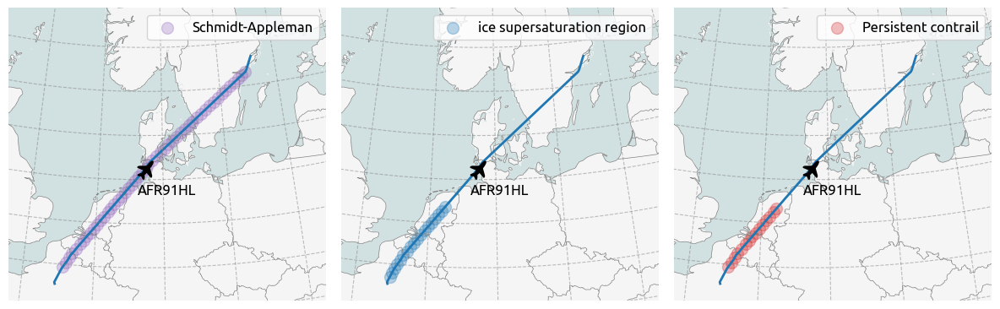{.fit-img}
:::
:::

## Altitude changes can help {.regular}

::: {.two-col}
:::{.compact}
- Contrail-diversion analyses suggest large mitigation potential.
- Around half of persistent contrails can be avoided with altitude changes in a simplified setup.
- The hard question is whether the idea survives operational constraints.
- Paper: **Contrail minimization through altitude diversions: A feasibility study leveraging global data**  
  <https://doi.org/10.1016/j.trip.2023.100953>
:::

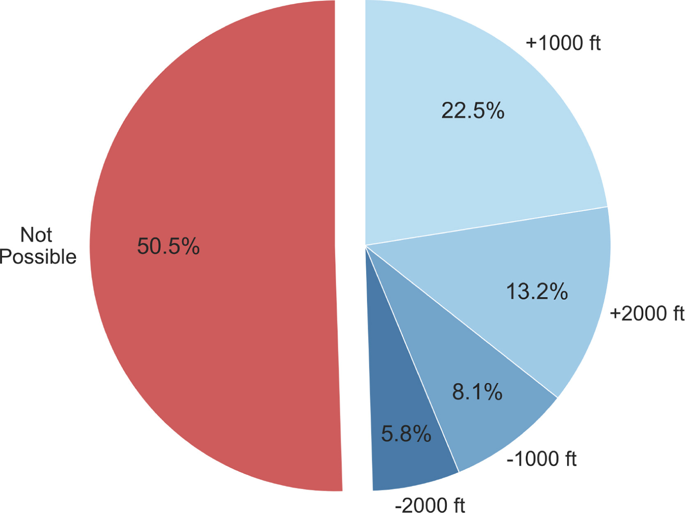{.fit-img}
:::

# Climate-Optimal Routing

## What was ignored in simple altitude-diversion studies? {.regular}

::: {.compact}
- Altitude diversion shows mitigation potential, but it is not yet operational routing.
- A flight-plan change also changes speed, lateral path, wind exposure, fuel burn, and sector demand.
- This leads to the next feasibility question: can climate-optimal routing work as an ATM procedure?
- Paper: **Contrail, or not contrail, that is the question: the "feasibility" of climate-optimal routing**  
  <https://arxiv.org/abs/2504.13907>
:::

::: {.callout}
This is the point where “contrail mitigation potential” becomes a routing, network, and governance problem.
:::

## The climate-optimal routing paper asks four questions {.regular}

::: {.two-col}
:::{.compact}
- **Fuel:** can we reduce contrails with reasonable excess fuel?
- **Weather:** can forecasts support rerouting decisions?
- **Network:** are contrail-optimized trajectories sustainable for air-traffic-flow management?
- **Governance:** who is responsible for climate-optimal routing?
- **Open workflow:** <https://github.com/junzis/contrail-or-not>
:::

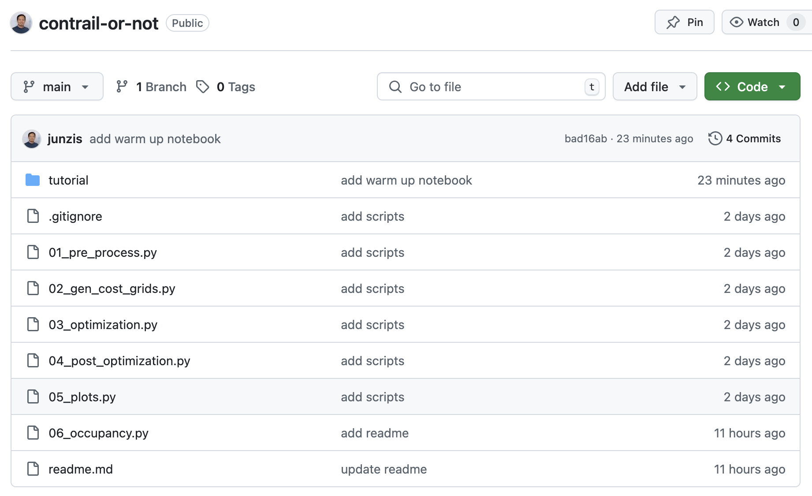{.fit-img}
:::

## From feasibility questions to 4D trajectory generation {.regular}

::: {.two-col}
:::{.compact}
- To answer the feasibility questions, we need complete trajectories, not altitude tweaks on fixed routes.
- `opentop` optimizes altitude, speed, timing, and lateral path together.
- Wind, aircraft performance, and gridded atmospheric costs enter the same nonlinear optimal-control problem.
- This creates comparable fuel-optimal and climate-aware trajectories.
:::

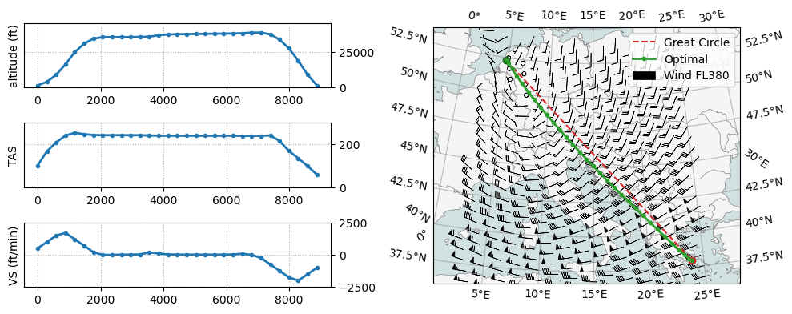{.fit-img}
:::

## Cost grids turn weather into optimization input {.regular}

::: {.two-col}
:::{.compact}
- Contrail-forming regions become gridded costs.
- The optimizer samples the grid along candidate trajectories.
- Fuel and contrail terms must be balanced explicitly.
- Smooth interpolation reduces discontinuities in the optimization problem.
- **ERA5 reanalysis** versus **ARPEGE forecast** on 20 February 2022.
:::

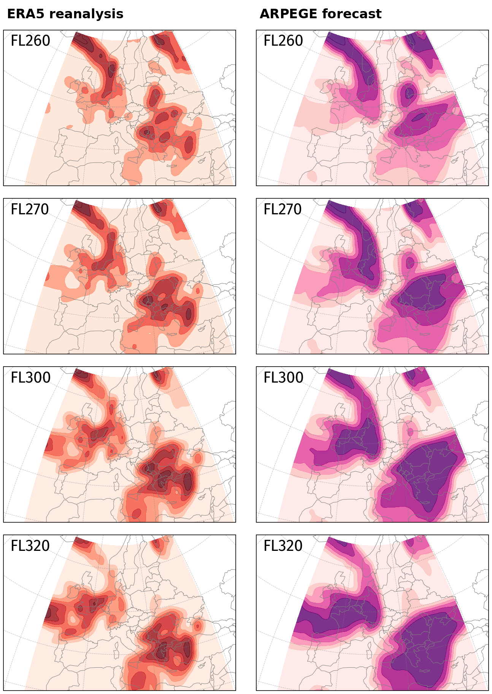{.cost-grid-pair}
:::

## Climate objective in opentop {.code}

The weather-derived cost grid from the previous slide becomes `df_cost`. The optimizer then balances gridded contrail cost against CO2 from fuel burn.

This cell is disabled here because the full grid solve is too heavy for a lecture render.

```{python}
#| eval: false
import openap
import opentop as top

optimizer = top.Cruise("A320", "EHAM", "LGAV", m0=0.85)
flight_fuel_optimal = optimizer.trajectory(objective="fuel")
interpolant = top.tools.interpolant_from_dataframe(df_cost)

def objective(x, u, dt, **kwargs):
    vtas = openap.casadi.aero.mach2tas(u[0], x[2])
    contrail_cost = optimizer.obj_grid_cost(
        x, u, dt, n_dim=3, time_dependent=False, **kwargs
    ) * vtas * 1e-3
    co2_cost = optimizer.obj_fuel(x, u, dt, **kwargs) * 7.03e-15
    return contrail_cost + co2_cost
```

## Fuel versus contrail trade-off {.regular}

::: {.two-col}
:::{.compact}
- Compare original flight, fuel-optimal flight, and contrail-aware variants.
- A higher contrail penalty can reduce contrail distance, but the fuel penalty and route deviation must be reported together.
- Vertical profiles: contrail-aware trajectories often shift altitude to avoid persistent regions.
- The challenge is whether avoidance is robust, affordable, and operationally acceptable.
:::

::: {.stacked-images .tall-stack}
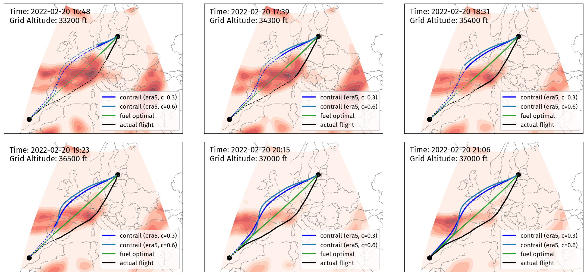
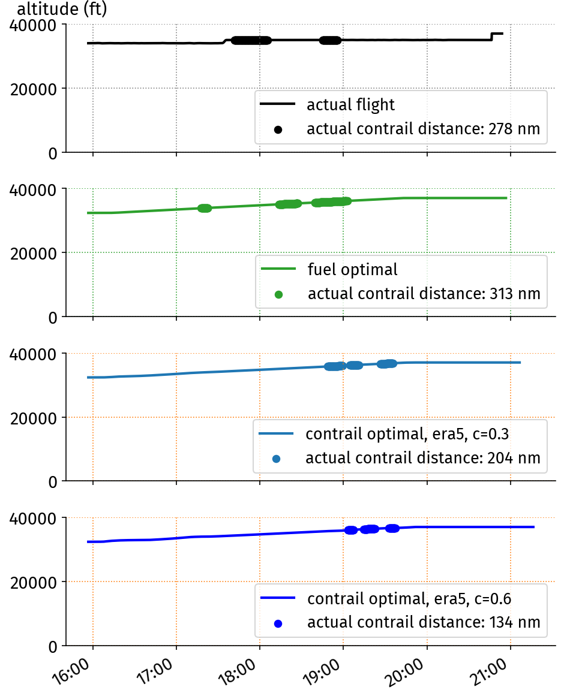
:::
:::

## Aggregate result from one day of flights {.regular}

::: {.paper-triptych}
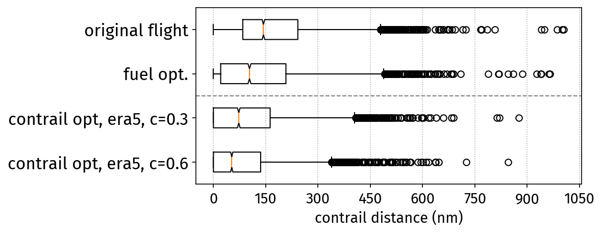

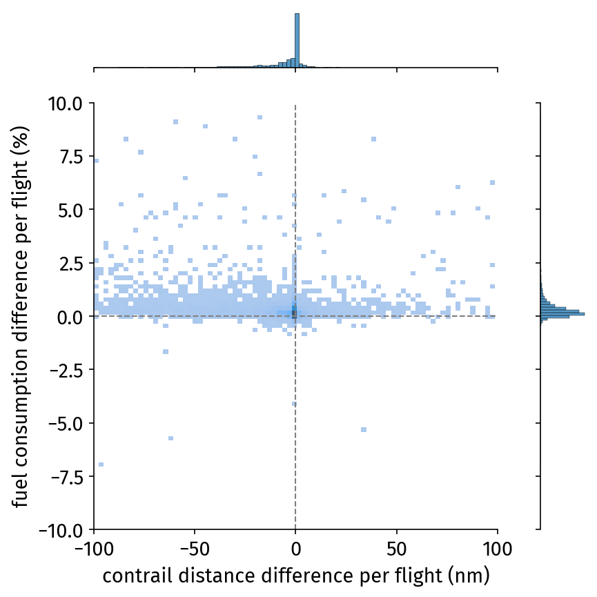

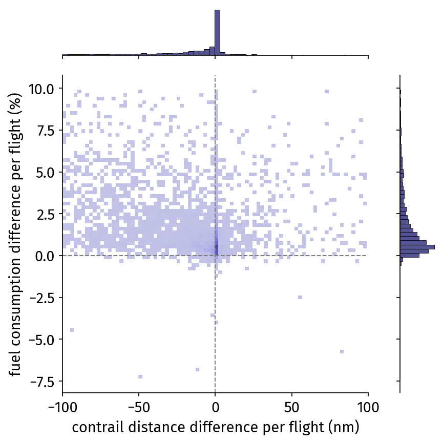
:::

## Forecast versus reanalysis {.regular}

::: {.two-col .wide-right}
:::{.compact}
- Operational decisions must use forecast data.
- Retrospective evaluation often uses reanalysis.
- If forecast and reanalysis disagree, optimized decisions can be misplaced.
- This is why contrail-routing studies must separate evaluation data from decision data.
:::

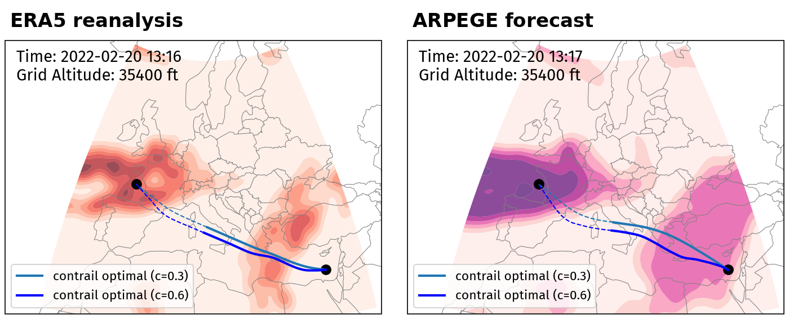{.wide-img}
:::

## Capacity changes when many aircraft reroute {.regular}

::: {.two-col}
:::{.compact}
- A single contrail-avoidance trajectory may look feasible.
- Many such trajectories can shift demand into other sectors.
- Capacity and fairness become part of the climate objective.
:::

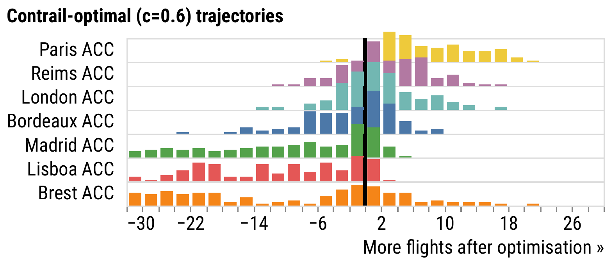{.wide-img}
:::

## Satellite check: what happened that day? {.regular}

::: {.two-col}
:::{.compact}
- Satellite observations provide an external check on model-based predictions.
- They also reveal the limits of simple formation estimates.
- Future workflows need data fusion: surveillance, meteorology, satellite, and ground cameras.
:::

::: {.stacked-images .tall-stack}
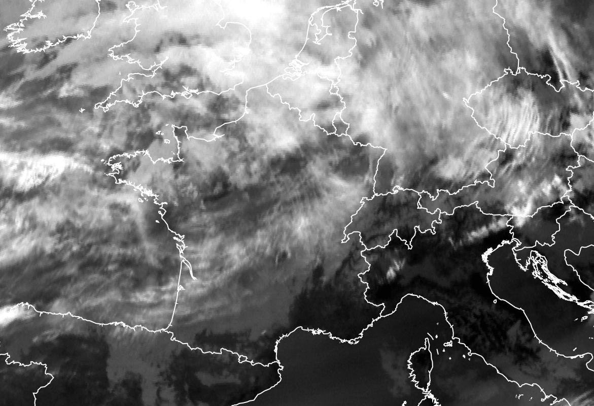
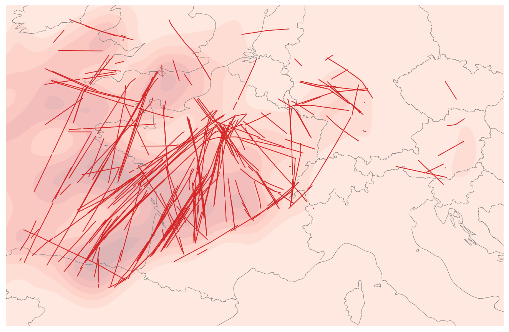
:::
:::

## Who should be responsible? {.regular}

::: {.two-col}
:::{.compact}
- Airlines control fuel and operating costs.
- ANSPs and network managers control flow and capacity.
- Passengers and society experience costs and benefits differently.
- Weather uncertainty and monitoring affect accountability.
- **OPTIMAL** (TU Delft - France Initiative) extends this into shared decision-making and operational feasibility.
- **FairSky** (SESAR ER3) addresses fairness when climate-optimal routing changes costs and capacity.
:::

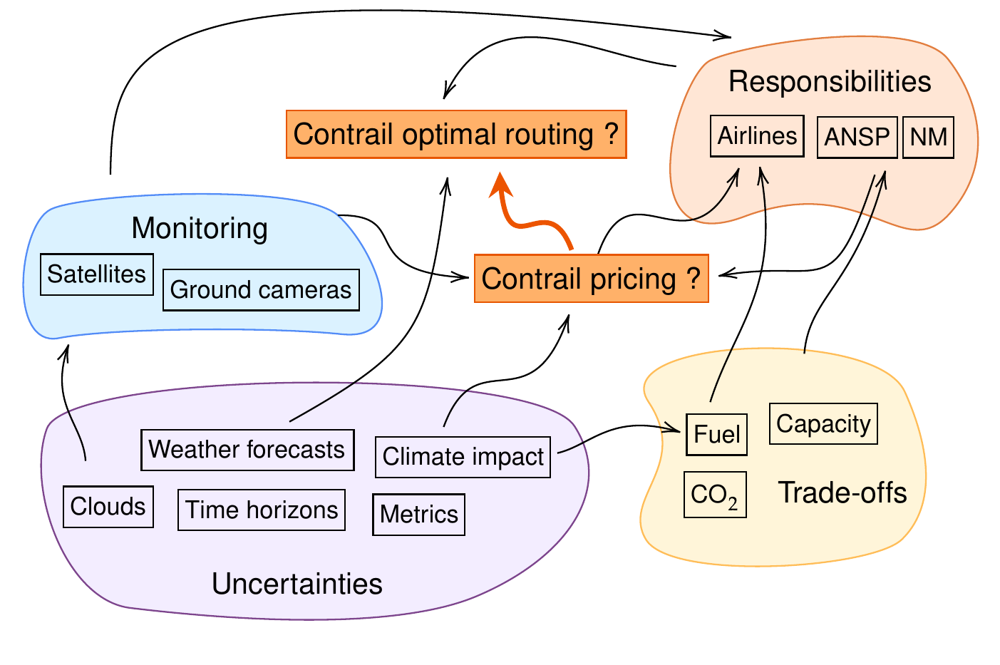{.fit-img}
:::

# Takeaways

## The reusable workflow {.regular}

::: {.compact}
1. **Get trajectories:** OpenSky and pyopensky.
2. **Estimate fuel and emissions:** OpenAP.
3. **Add weather and contrail conditions:** FastMeteo and OpenAP contrail tools.
4. **Compare decisions through optimization:** use `opentop` to test fuel, contrail, forecast, capacity, and responsibility trade-offs.
:::


## Links {.regular}

::: {.two-col}
:::{}
| Resource | Link |
|---|---|
| Lecture repository | <https://github.com/junzis/isa-research-school-2026> |
| OpenAP handbook | <https://openap.dev/> |
| pyopensky | <https://mode-s.org/pyopensky/> |
| fastmeteo | <https://github.com/open-aviation/fastmeteo> |
| OpenSky Network | <https://opensky-network.org/> |
| contrail-or-not | <https://github.com/junzis/contrail-or-not> |
| Quarto RevealJS | <https://quarto.org/docs/presentations/revealjs/> |
:::

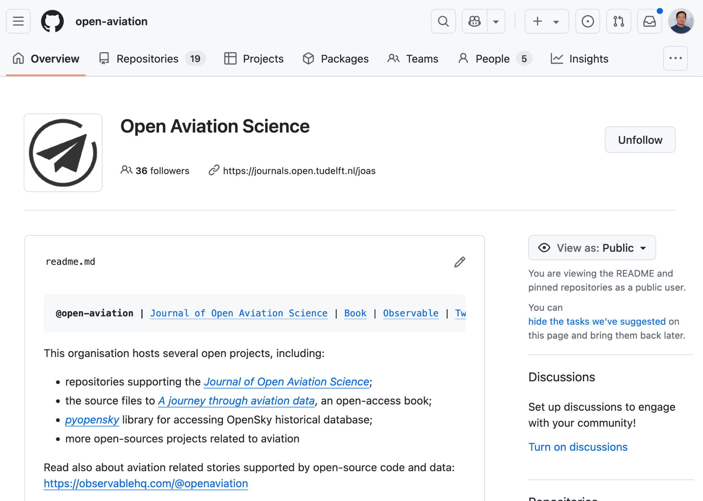{.fit-img}
:::
